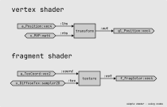

# Shader Nodes

## Shader in GLSL

Let's take a look at a simple shader, with the vertex code:

```glsl
#version 300 es

layout(location = 0) in vec4 v_Position;
layout(location = 1) in vec2 v_TexCoord;

uniform mat4 u_MVP;

out vec2 f_TexCoord;

void main() {
    gl_Position = u_MVP * v_Position;
    f_TexCoord = v_TexCoord;
}
```

and the fragment code:

```glsl
#version 300 es
precision mediump;

in vec2 f_TexCoord;

uniform sampler2D f_DiffuseTex;

out vec4 f_FragColor;

void main() {
    f_FragColor = texture(f_DiffuseTex, f_TexCoord);
}
```

## Shader using nodes

In this example, we want a shader that only does the most basic vertex transformation and texture mapping.

### Diagram

We take inputs and want to produce an output, like this:



### Java

We need shader context, for our shader variables:

```java
class SimpleShaderContext {
    public ArrayBuffer<Vector4> vertexPosition;
    public ArrayBuffer<Vector2> vertexTexCoord;
    
    public Matrix4 MVPMatrix;
    public Texture2D diffuseTexture;
}
```

Then we can create node shader:

```java
class SimpleShaderNodes {
    public static ShaderNode getVertexShaderNodes(SimpleShaderContext ctx) {
        return TransformNode
                .with(InputNode.of(ctx.vertexPosition), InputNode.of(ctx.MVPMatrix))
                .to(OutputNode.of(OutputField.VERTEX_POSITION));
    }

    public static ShaderNode getFragmentShaderNodes(SimpleShaderContext ctx) {
        return TextureNode
                .with(InputNode.of(ctx.diffuseTexture), InputNode.of(ctx.vertexTexCoord))
                .to(OutputNode.of(OutputField.FRAGMENT_COLOR));
    }
}
```
